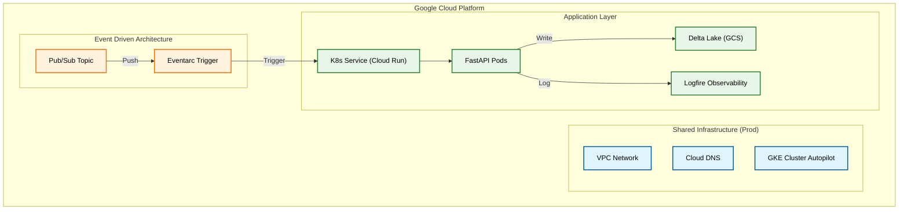

# Event-Driven GCP 🚀

[](https://img.shields.io/github/v/release/jojo/event-driven-gcp)
[](https://github.com/jojo/event-driven-gcp/actions/workflows/main.yml?query=branch%3Amain)
[](https://codecov.io/gh/jojo/event-driven-gcp)
[](https://img.shields.io/github/commit-activity/m/jojo/event-driven-gcp)
[](https://img.shields.io/github/license/jojo/event-driven-gcp)

An event-driven architecture implementation on Google Cloud Platform that ingests CloudEvents from Pub/Sub and stores them in Delta Lake format on GCS.

- **Github repository**: <https://github.com/jojo/event-driven-gcp/>
- **Documentation**: <https://jojo.github.io/event-driven-gcp/>

## Features

- ✨ **CloudEvent Ingestion**: Receive and process CloudEvents via Google Cloud Pub/Sub
- 🗄️ **Delta Lake Storage**: ACID-compliant storage with merge and time-travel capabilities
- 🔄 **Content-Based Deduplication**: Hash-based unique ID generation to prevent duplicate events
- ⚡ **Auto-Optimization**: Automatic table compaction and vacuum after ingestion
- 🐻‍❄️ **Polars Integration**: High-performance DataFrame operations for data processing
- 📊 **Observability**: Structured logging with Logfire and Loguru integration
- 🔐 **Secret Management**: Secure token storage via Google Secret Manager
- 🏗️ **Infrastructure as Code**: Complete Terraform modules for GCP deployment
- 🐳 **Docker Compose**: Local development with GCP credentials volume mounting
- 🎯 **Event-Driven Architecture**: Native Cloud Run service integration with Eventarc
- 🛡️ **Secure Storage**: GCS access with least-privilege IAM policies
- ⚡ **Ephemeral Environments**: Automatic per-PR environment creation on Shared Cluster
- 🧩 **Shared Infrastructure**: Efficient resource usage with consolidated GKE/VPC
- ⏱️ **Temporal Cloud**: Durable workflow orchestration with ephemeral workers
- 🔁 **Ephemeral Workers**: Workers start/stop per request for efficient resource usage (see [Adding Workers](https://jojo.github.io/event-driven-gcp/kubernetes/#adding-temporal-workers))

## Architecture



The system follows an event-driven pattern where:

1. Events are published to a Pub/Sub topic
2. Eventarc triggers the GKE service via native integration
3. FastAPI API receives and validates the CloudEvent
4. Data is decoded from base64 and parsed as JSON
5. A unique ID is generated using SHA256 hash of event content
6. Data is validated with Pydantic models
7. **Temporal Workflow** is triggered with ephemeral worker
8. Events are processed and upserted into Delta Lake tables on GCS
9. Tables are automatically optimized (compact + vacuum)
10. Worker shuts down and response is returned

## Quick Start

### Prerequisites

- Python 3.11+
- [uv](https://github.com/astral-sh/uv) package manager
- Google Cloud SDK (for deployment)
- Terraform (for infrastructure)

### Local Development

1. **Clone the repository**
   ```bash
   git clone https://github.com/jojo/event-driven-gcp.git
   cd event-driven-gcp
   ```

2. **Install dependencies**
   ```bash
   make install
   ```

3. **Run the API locally (with Docker Compose)**

   ```bash
   docker compose up --build
   ```

   This mounts your GCP credentials automatically from `~/.config/gcloud/application_default_credentials.json`.

4. **Or run without Docker**

   ```bash
   uv run uvicorn api.app:app --reload
   ```

5. **Run tests**

   ```bash
   make test
   ```

### Infrastructure Deployment

1. **Configure GCP backend**
   ```bash
   cd infra
   # Edit backend configuration
   terraform init -backend-config=backend/dev.gcs.backend
   ```

2. **Deploy infrastructure**
   ```bash
   terraform plan
   terraform apply
   ```

3. **Deploy the API**
   ```bash
   make deploy
   ```

## Project Structure

```
event-driven-gcp/
├── api/                      # FastAPI application
│   ├── routers/             # API endpoints
│   ├── models/              # Pydantic models
│   ├── docs/                # OpenAPI documentation
│   └── utils/               # Configuration and utilities
├── infra/                   # Terraform infrastructure
│   ├── modules/             # Reusable Terraform modules
│   │   ├── cloud-dns/       # Cloud DNS Zone & Records
│   │   ├── cloud-domains/   # Domain Registration
│   │   ├── gke-cluster/     # GKE Standard Cluster
│   │   ├── network/         # VPC, Subnets, Global IP
│   │   ├── security/        # SSL Policies
│   │   └── service-accounts/# IAM & Service Accounts
│   └── backend/             # Terraform backend configs
├── tests/                   # Test suite
└── docs/                    # MkDocs documentation
```

## GKE Standard Cluster Infrastructure 🏗️

This project now includes a production-ready GKE Standard cluster setup via Terraform.

### Features
*   **GKE Standard**: Best-practice cluster with separate node pools.
*   **Global Networking**: VPC-native cluster with specific subnets.
*   **Cloud DNS**: Automatic DNS zone management.
*   **Cloud Domains**: **Optional** automated domain registration via Terraform.
*   **Security**: Least-privilege IAM for GKE Service Accounts (GCS, BigQuery).
*   **Ingress**: Global Load Balancing with Managed SSL Certificates (`ManagedCertificate`).

### Deployment Guide

1.  **Initialize Terraform**
    ```bash
    make init_local_terraform
    ```

2.  **Configure Variables**
    Edit `infra/terraform/tfvars/local.tfvars` with your project ID and **Contact Info** (Required for Cloud Domains).

3.  **Plan & Apply (Production)**
    ```bash
    # Select Production Workspace
    terraform workspace select default

    make plan_local_terraform
    make apply_local_terraform
    ```

    *For Ephemeral Environments, the CI/CD pipeline handles workspace selection automatically based on the branch name.*

4.  **Deploy Kubernetes Manifests**
    ```bash
    make apply_k8s
    ```

### ⚠️ Critical Warning: Infrastructure Destruction

> [!WARNING]
> **Manual Deletion Required for Cloud Domains**
> Terraform is configured to **abandon** the `google_clouddomains_registration` resource upon destruction to prevent accidental loss of domain ownership.
> **You must delete the Domain and DNS Zone manually** in the Google Cloud Console if you wish to stop billing/ownership. Terraform will NOT delete them.

### Troubleshooting Ingress 🕵️‍♂️

If you see a `502 Bad Gateway` or `Server Error`:
1.  **Check Backends**: `kubectl describe ingress` -> Check `Backends`.
    *   If `Unknown/Unhealthy`: It's usually a Health Check failure.
2.  **Port Mismatch**: Ensure your **Service** `targetPort` matches the **Container** port.
    *   *Example*: App listens on `8080`, Service must target `8080`.
3.  **Labels**: Ensure Service `selector` matches Deployment `labels`.

## API Endpoints

### `POST /api/v1/ingest_event`

Ingests CloudEvents from Pub/Sub into Delta Lake.

**Request Example:**
```json
{
  "message": {
    "data": "eyJuYW1lIjogIkpvaG4iLCAibGFzdG5hbWUiOiAiRG9lIn0=",
    "messageId": "123456789",
    "publishTime": "2025-11-24T10:00:00Z"
  }
}
```

**Response:**
```json
{
  "status": "success",
  "message_data": "{\"name\": \"John\", \"lastname\": \"Doe\"}"
}
```

## Configuration

### Environment Variables

```bash
BUCKET_NAME="event-driven"           # GCS bucket name for Delta Lake
API_V1_STR="/api/v1"                # API prefix
GCP_PROJECT_ID="dataascode"         # GCP project ID
LOGFIRE_SECRET_NAME="LOGFIRE_TOKEN_EVENT_DRIVEN_TEMPLATE"  # Secret Manager secret name
```

### Google Secret Manager

The Logfire token is securely stored in Google Secret Manager and retrieved at runtime:

```python
from api.utils.secrets import get_secret_from_gcp

logfire_token = get_secret_from_gcp(
    project_id=settings.GCP_PROJECT_ID,
    secret_name=settings.LOGFIRE_SECRET_NAME,
)
```

### Unique ID Generation

Events are deduplicated using content-based hashing to prevent duplicate ingestion:

```python
def generate_unique_id(data: dict) -> str:
    """Generate deterministic ID from event content."""
    sorted_data = json.dumps(data, sort_keys=True)
    return hashlib.sha256(sorted_data.encode()).hexdigest()
```

This ensures that:
- ✅ Same content = same ID (idempotent)
- ✅ Different content = different ID
- ✅ No duplicates even if re-published

## Development

### Code Quality

```bash
# Run linting
make check

# Format code
uv run ruff format .

# Type checking
uv run mypy .
```

### Testing

```bash
# Run all tests
make test

# Run with coverage
make test-cov
```

## Contributing

See [CONTRIBUTING.md](https://github.com/jojo/event-driven-gcp/blob/main/CONTRIBUTING.md) for development guidelines.

## License

This project is licensed under the MIT License - see the [LICENSE](https://github.com/jojo/event-driven-gcp/blob/main/LICENSE) file for details.

## CI/CD Pipeline

The project uses GitHub Actions for automated deployment:

### Docker Image Tags

Each build creates multiple Docker image tags:
- `{SHA}` - Git commit short SHA (7 characters)
- `{YYYYMMDD-HHMMSS}` - Build timestamp
- `latest` - Latest successful build

### Deployment Flow

1. **Build & Test**: Run tests and type checking
2. **Terraform**: Deploy Artifact Registry
3. **Docker**: Build and push multi-tag image
4. **Deploy**: Update Cloud Run service
5. **Documentation**: Deploy MkDocs to GitHub Pages

## IAM & Security

### Service Accounts

**Cloud Run Runtime** (`cloudrun-runtime-{env}`):
- `roles/secretmanager.secretAccessor` - Access secrets
- `roles/storage.objectAdmin` - Read/write GCS objects
- `roles/bigquery.jobUser` - Run BigQuery jobs

**Eventarc Triggers** (`eventarc-triggers-{env}`):
- `roles/eventarc.eventReceiver` - Receive events
- `roles/run.invoker` - Invoke Cloud Run
- `roles/pubsub.subscriber` - Subscribe to topics

### Secret Management

Sensitive credentials are stored in Google Secret Manager:
```bash
# Create secret
echo -n "your-logfire-token" | gcloud secrets create LOGFIRE_TOKEN_EVENT_DRIVEN_TEMPLATE --data-file=-

# Grant access
gcloud secrets add-iam-policy-binding LOGFIRE_TOKEN_EVENT_DRIVEN_TEMPLATE \
  --member="serviceAccount:cloudrun-runtime-dev@PROJECT_ID.iam.gserviceaccount.com" \
  --role="roles/secretmanager.secretAccessor"
```

## Technology Stack

- **API**: [FastAPI](https://fastapi.tiangolo.com/) - Modern async Python web framework
- **Storage**: [Delta Lake](https://delta.io/) - ACID-compliant data lake
- **Data Processing**: [Polars](https://pola.rs/) - Lightning-fast DataFrame library
- **Cloud**: [Google Cloud Platform](https://cloud.google.com/) - Serverless infrastructure
- **Observability**: [Logfire](https://logfire.pydantic.dev/) - Real-time monitoring
- **IaC**: [Terraform](https://www.terraform.io/) - Infrastructure as Code
- **CI/CD**: [GitHub Actions](https://github.com/features/actions) - Automated deployment

## Acknowledgments

- Built with [FastAPI](https://fastapi.tiangolo.com/)
- Storage powered by [Delta Lake](https://delta.io/)
- Data processing with [Polars](https://pola.rs/)
- Deployed on [Google Cloud Platform](https://cloud.google.com/)
- Observability with [Logfire](https://logfire.pydantic.dev/)
