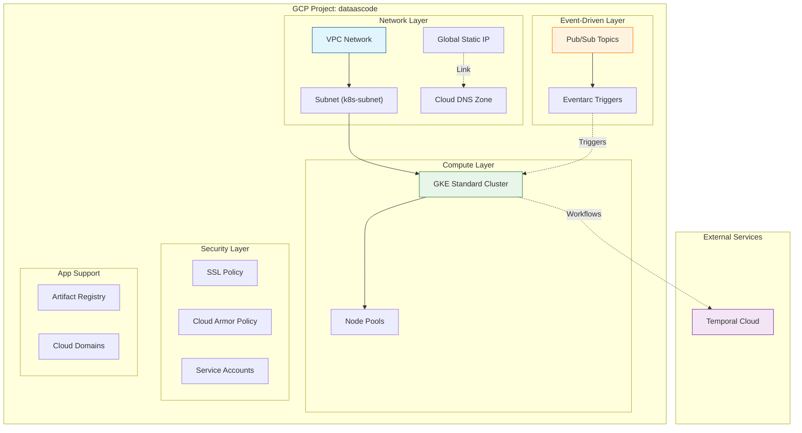
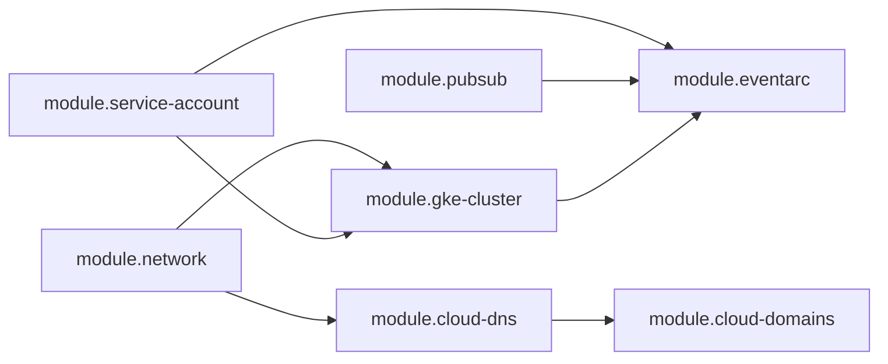
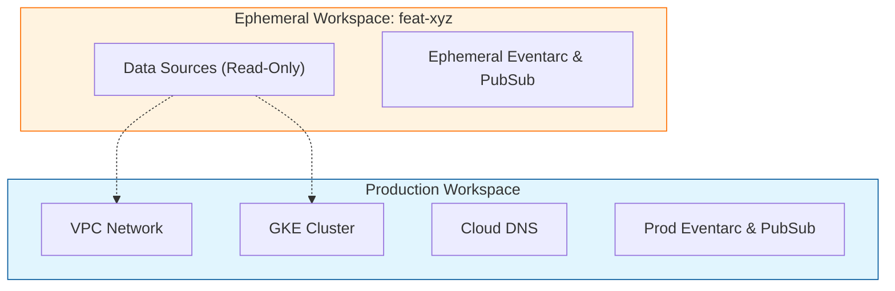

# Infrastructure (Terraform) 🏗️

The infrastructure is managed as code (IaC) using Terraform. It follows a modular design to ensure reusability, consistency, and separation of concerns.

## Global Infrastructure Schema




## Module Dependencies

The Terraform configuration is split into functional layers.



## Detailed Modules

### 1. Core Networking (`modules/network`)

* **VPC**: Custom VPC network (not using default).
* **Subnet**: Specific subnet (`10.0.0.0/24`) with secondary ranges for Pods and Services (VPC-native).
* **Global Address**: Reserves a static external IP (`google_compute_global_address`) used by the Ingress Controller.

### 2. Compute (`modules/gke-cluster`)

* **Cluster**: GKE Standard regional cluster.
* **Node Pools**: Dedicated node pools (e.g., `primary-pool`).
* **Security**:
  * Workload Identity enabled.
  * Shielded Nodes enabled.
  * Private nodes (no external IPs on nodes).

### 3. DNS & Domains (`modules/cloud-dns`, `modules/cloud-domains`)
*   **Cloud DNS**: Manages the managed zone `templatejojotest.com`.
*   **A Records**: Automatically maps the Global Static IP to the domain root.
*   **Cloud Domains**: (Optional) Handles domain registration and directs name servers to Cloud DNS.

### 4. Event Driven (`modules/pubsub`, `modules/eventarc`)
*   **Pub/Sub**: Creates topics (`event-ingestion`) and subscriptions.
*   **Eventarc**: Creates triggers that listen to Pub/Sub messages and forward them to the GKE Service (`event-driven-api`).
    *   *Note*: Requires the GKE Service to be exposed internally or via Cloud Run for Anthos (here using native GKE destinations).

### 5. Security & IAM (`modules/security`, `modules/service-accounts`)

- **Service Accounts**:
  - `cloudrun-runtime`: Used by Pods (Workload Identity).
  - `eventarc-triggers`: Used by Eventarc to invoke the service.
- **SSL Policy**: Enforces TLS 1.2+ configuration for the Load Balancer.

### 6. Temporal Cloud (External Service)

- **Durable Workflows**: Orchestrates long-running business processes with automatic retries.
- **Ephemeral Workers**: Workers are created per-request and destroyed after execution for efficient resource usage. (See [Adding Workers](kubernetes.md#adding-temporal-workers))
- **Configuration**:
  - `TEMPORAL_ADDRESS`: Temporal Cloud endpoint (e.g., `europe-west3.gcp.api.temporal.io:7233`)
  - `TEMPORAL_NAMESPACE`: Your Temporal namespace
  - `TEMPORAL_API_KEY`: Stored in Google Secret Manager

## Architecture Strategy 🧠

### Shared Cluster Topology

To optimize costs and provisioning time, we use a **Shared Cluster** strategy:

*   **Production (`default` workspace)**: Owns the "Physical" layer (VPC, GKE Cluster, DNS Zone).
*   **Ephemeral Workspaces (e.g., `feat-login`)**: Read the existing infrastructure via Terraform Data Sources. They Only deploy **Logical** isolated resources (Pub/Sub Topics, Eventarc Triggers).



## Deployment 🚀

### Manual Deployment

```bash
# 1. Initialize
make init_local_terraform

# 2. Select Workspace (Critical!)
# For Prod:
terraform workspace select default

# For Feature Dev:
terraform workspace new feat-my-feature || terraform workspace select feat-my-feature

# 3. Plan & Apply
make plan_local_terraform
make apply_local_terraform
```

### CI/CD Automation

References to workspaces are handled automatically by **GitHub Actions**:
*   **Main Branch** → Selects `default` workspace.
*   **Feature Branches** → Selects/Creates `feat-<branch-name>` workspace.
