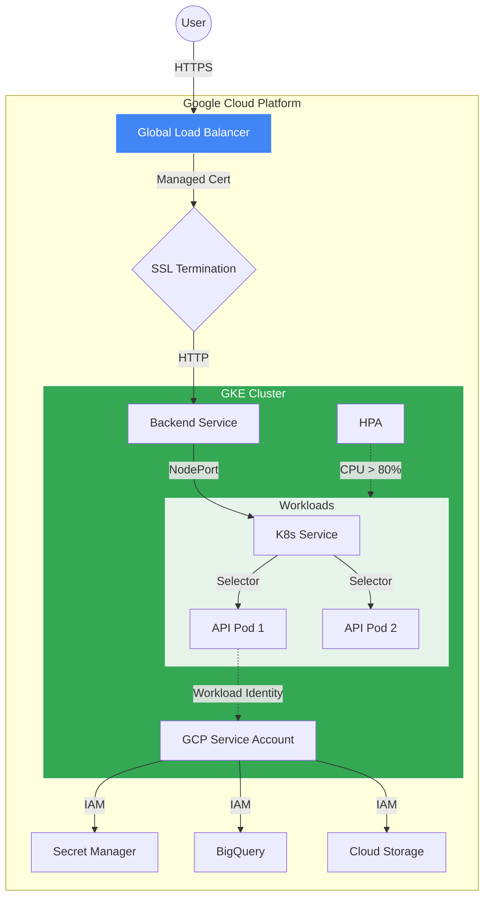
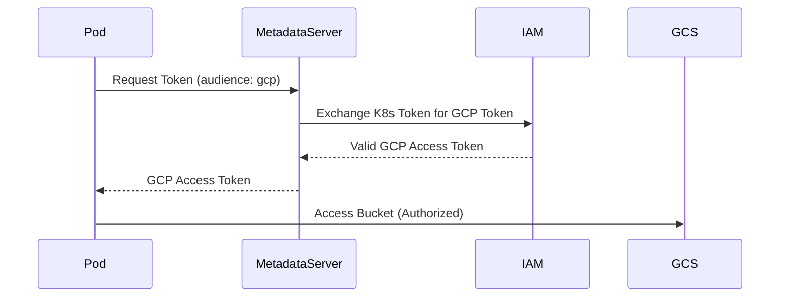

# Kubernetes & Ingress ☸️

## Global Architecture

The architecture relies on **GKE Standard** for container orchestration, coupled with **GCE Ingress** for global traffic management and **Workload Identity** for secure GCP access.



## Detailed Components

### 1. Ingress (GCE L7 Load Balancer)

We use the Google Cloud native Ingress controller (`gce`), which provisions a Global External HTTP(S) Load Balancer.

*   **Managed Certificate** (`ManagedCertificate`): Automatically provisions and renews Google-managed SSL certificates.
    *   **Domain**: `templatejojotest.com` (Production)
    *   **Status Check**: `kubectl get managedcertificate` (State should be `ACTIVE`).
*   **FrontendConfig**: Controls the Load Balancer frontend behavior.
    *   **HTTP-to-HTTPS Redirect**: Enforced automatically.
    *   **SSL Policy**: Uses a modern SSL policy (TLS 1.2+).
*   **BackendConfig**: Controls backend configuration.
    *   **Health Checks**: Custom health check path (`/`) and timeout settings.
    *   **Cloud Armor**: (Optional) WAF integration.
    *   **Connection Draining**: Timeout ensuring graceful shutdowns.

### 2. Workload Identity (Security)

We do **not** use JSON keys. We use **Workload Identity** to map Kubernetes Service Accounts (KSA) to Google Service Accounts (GSA).



**Configuration steps:**
1.  **GCP**: Create GSA (`gke-sa@project.iam.gserviceaccount.com`).
2.  **IAM**: Grant `roles/iam.workloadIdentityUser` to `serviceAccount:project.svc.id.goog[namespace/ksa-name]`.
3.  **K8s**: Annotate KSA with `iam.gke.io/gcp-service-account: gke-sa@...`.

### 3. Scaling (HPA)

The Horizontal Pod Autoscaler (HPA) automatically adjusts the number of pods based on CPU utilization.

*   **Metric**: `targetCPUUtilizationPercentage: 80`
*   **Min Replicas**: `1` (Can be raised for prod high-availability)
*   **Max Replicas**: `10`
*   **Behavior**: When average CPU across pods exceeds 80% of the *Requested* CPU, new replicas are added.

## Deployment Strategy

### Production (`default` namespace)
*   **DNS**: `templatejojotest.com`
*   **Certificate**: Production Managed Certificate.
*   **Ingress**: Static IP reservation (`google_compute_global_address`).

### ⚡ Ephemeral Environments (`feat-*`)
*   **Namespace**: Dynamic (e.g., `feat-login`).
*   **Routing**:
    *   Deployed via Helm.
    *   Uses the **same** Ingress Controller but differentiates via **Traffic Splitting** (if configuring Istio) or separate Ingress resources (if configuring distinct hostnames).
    *   *Current Setup*: Deploys a separate Ingress. Note that creating multiple GCE Ingresses can take time (~5-10 mins) for LB provisioning.

## Troubleshooting 🛠️

### ⚠️ 502 Bad Gateway
This is the most common error with GCE Ingress.

| Cause | Verification | Fix |
|-------|--------------|-----|
| **Pod Startup** | `kubectl get pods` | Wait for `Running` state (Probe success). |
| **Health Check** | `kubectl describe ingress` | Check `Backends` section for `Unhealthy`. |
| **Firewall** | `gcloud compute firewall-rules list` | Ensure GFE IPs (130.211.0.0/22, 35.191.0.0/16) can reach Nodes. |
| **TargetPort** | `kubectl get svc` | Service `targetPort` **must** match Pod `containerPort`. |

### ⚠️ 403 Permission Denied (GCP)
If the pod cannot access GCS or Secret Manager:

1.  **Check Annotation**:
    ```bash
    kubectl get sa -n <namespace> <sa-name> -o yaml
    # Look for: iam.gke.io/gcp-service-account
    ```
2.  **Check Binding**:
    ```bash
    gcloud iam service-accounts get-iam-policy <gsa-email>
    # Look for: roles/iam.workloadIdentityUser bound to the correct K8s SA.
    ```

### ⚠️ Certificate Provisioning Fails
*   **Check DNS**: The domain **must** point to the Ingress static IP. Google won't provision the cert if DNS validation fails.
*   **Check Quota**: Ensure you haven't exceeded SSL cert quotas.
